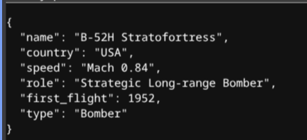

# AvGeek API

A Minimal HTTP API server written in Go that **Returns** aircraft specifications.

## Overview

This api provides a single endpoint that returns a randomly selected aircraft from an internal dataset. It delivers a structured `JSON` formatted data of Aircraft Worldwide.



## Requirements

* **Go**

## Execution

1. Run the server directly:
```bash
go run .

```

2. Navigate to `http://localhost:6969/`


## Configure

The server listens on port `6969` by default. You can override it by running 
```bash
PORT=8080 go run .
```

## Note
You can customize the dataset to your preferred topic or something you name it.<br>
**Use this as Template to create your own api server** <br>
You can easily deploy this api server in Railway or Render.com or Self host and configure it to your router setup